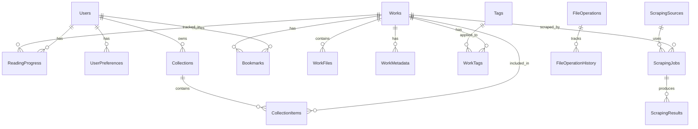

# Diagramme de Modélisation de la Base de Données FenReads

## Vue d'ensemble des tables



## Tables principales

### 1. Users (Utilisateurs)
```sql
CREATE TABLE Users (
    Id UUID PRIMARY KEY DEFAULT gen_random_uuid(),
    Username VARCHAR(100) UNIQUE NOT NULL,
    Email VARCHAR(255) UNIQUE NOT NULL,
    PasswordHash VARCHAR(255) NOT NULL,
    Role VARCHAR(50) NOT NULL, -- Admin, User, Guest
    IsActive BOOLEAN DEFAULT true,
    CreatedAt TIMESTAMP DEFAULT CURRENT_TIMESTAMP,
    UpdatedAt TIMESTAMP DEFAULT CURRENT_TIMESTAMP,
    LastLoginAt TIMESTAMP
);
```

### 2. Works (Œuvres - Table principale avec héritage)
```sql
CREATE TABLE Works (
    Id UUID PRIMARY KEY DEFAULT gen_random_uuid(),
    WorkType VARCHAR(50) NOT NULL, -- Manga, BD, LightNovel, WebNovel, Webcomic
    Title VARCHAR(500) NOT NULL,
    OriginalTitle VARCHAR(500),
    AlternativeTitles JSONB, -- ["Title 1", "Title 2"]
    Synopsis TEXT,
    Status VARCHAR(50), -- Ongoing, Completed, Abandoned, Licensed
    ReleaseDate DATE,
    CoverPath VARCHAR(500),
    Language VARCHAR(10),
    
    -- Champs communs optionnels
    Author VARCHAR(255),
    Artist VARCHAR(255),
    
    -- Métadonnées spécifiques stockées en JSON
    SpecificData JSONB, -- {demographic: "Shonen", magazine: "Jump", etc.}
    
    -- Source info
    SourceType VARCHAR(100), -- Local, MangasOrigines, ChiReads, etc.
    SourceUrl VARCHAR(500),
    LastScrapeDate TIMESTAMP,
    AutoUpdate BOOLEAN DEFAULT false,
    
    CreatedAt TIMESTAMP DEFAULT CURRENT_TIMESTAMP,
    UpdatedAt TIMESTAMP DEFAULT CURRENT_TIMESTAMP,
    
    INDEX idx_work_type (WorkType),
    INDEX idx_work_title (Title),
    INDEX idx_work_status (Status)
);
```

### 3. WorkFiles (Fichiers associés aux œuvres)
```sql
CREATE TABLE WorkFiles (
    Id UUID PRIMARY KEY DEFAULT gen_random_uuid(),
    WorkId UUID NOT NULL REFERENCES Works(Id) ON DELETE CASCADE,
    FilePath VARCHAR(1000) NOT NULL,
    FileName VARCHAR(500) NOT NULL,
    FileFormat VARCHAR(20), -- PDF, CBZ, CBR, EPUB, TXT, etc.
    FileSize BIGINT,
    FileHash VARCHAR(64), -- SHA256 pour détecter les doublons
    
    VolumeNumber INT,
    ChapterNumber DECIMAL(10,2),
    ChapterTitle VARCHAR(500),
    PageCount INT,
    
    IsDownloaded BOOLEAN DEFAULT true,
    DownloadUrl VARCHAR(1000), -- Pour contenu scrappé non encore téléchargé
    
    CreatedAt TIMESTAMP DEFAULT CURRENT_TIMESTAMP,
    UpdatedAt TIMESTAMP DEFAULT CURRENT_TIMESTAMP,
    
    INDEX idx_workfile_work (WorkId),
    INDEX idx_workfile_hash (FileHash),
    UNIQUE KEY unique_file_path (FilePath)
);
```

### 4. WorkMetadata (Métadonnées externes)
```sql
CREATE TABLE WorkMetadata (
    Id UUID PRIMARY KEY DEFAULT gen_random_uuid(),
    WorkId UUID NOT NULL REFERENCES Works(Id) ON DELETE CASCADE,
    Source VARCHAR(100) NOT NULL, -- MAL, AniList, Nautiljon, etc.
    ExternalId VARCHAR(255),
    Url VARCHAR(500),
    
    RawData JSONB, -- Données brutes de l'API
    
    LastUpdateAt TIMESTAMP DEFAULT CURRENT_TIMESTAMP,
    
    INDEX idx_metadata_work (WorkId),
    UNIQUE KEY unique_work_source (WorkId, Source)
);
```

### 5. ReadingProgress (Progression de lecture)
```sql
CREATE TABLE ReadingProgress (
    Id UUID PRIMARY KEY DEFAULT gen_random_uuid(),
    UserId UUID NOT NULL REFERENCES Users(Id) ON DELETE CASCADE,
    WorkId UUID NOT NULL REFERENCES Works(Id) ON DELETE CASCADE,
    
    -- Pour Manga/BD
    CurrentPage INT,
    TotalPages INT,
    
    -- Pour Novels
    CurrentChapter DECIMAL(10,2),
    LastPosition TEXT, -- Position dans EPUB
    
    -- Pour Webcomics
    LastScrollPosition INT,
    
    Status VARCHAR(50) NOT NULL, -- NotStarted, Reading, Completed, Dropped
    Notes TEXT,
    
    LastReadDate TIMESTAMP,
    ReadingTime INTERVAL,
    
    CreatedAt TIMESTAMP DEFAULT CURRENT_TIMESTAMP,
    UpdatedAt TIMESTAMP DEFAULT CURRENT_TIMESTAMP,
    
    INDEX idx_progress_user (UserId),
    INDEX idx_progress_work (WorkId),
    UNIQUE KEY unique_user_work (UserId, WorkId)
);
```

### 6. Collections (Collections utilisateur)
```sql
CREATE TABLE Collections (
    Id UUID PRIMARY KEY DEFAULT gen_random_uuid(),
    UserId UUID NOT NULL REFERENCES Users(Id) ON DELETE CASCADE,
    Name VARCHAR(255) NOT NULL,
    Description TEXT,
    SortOrder INT DEFAULT 0,
    
    CreatedAt TIMESTAMP DEFAULT CURRENT_TIMESTAMP,
    UpdatedAt TIMESTAMP DEFAULT CURRENT_TIMESTAMP,
    
    INDEX idx_collection_user (UserId)
);
```

### 7. CollectionItems (Éléments dans les collections)
```sql
CREATE TABLE CollectionItems (
    Id UUID PRIMARY KEY DEFAULT gen_random_uuid(),
    CollectionId UUID NOT NULL REFERENCES Collections(Id) ON DELETE CASCADE,
    WorkId UUID NOT NULL REFERENCES Works(Id) ON DELETE CASCADE,
    AddedAt TIMESTAMP DEFAULT CURRENT_TIMESTAMP,
    SortOrder INT DEFAULT 0,
    
    UNIQUE KEY unique_collection_work (CollectionId, WorkId)
);
```

### 8. Bookmarks (Marque-pages)
```sql
CREATE TABLE Bookmarks (
    Id UUID PRIMARY KEY DEFAULT gen_random_uuid(),
    UserId UUID NOT NULL REFERENCES Users(Id) ON DELETE CASCADE,
    WorkId UUID NOT NULL REFERENCES Works(Id) ON DELETE CASCADE,
    WorkFileId UUID REFERENCES WorkFiles(Id) ON DELETE CASCADE,
    
    Title VARCHAR(255),
    PageNumber INT,              -- Pour Manga/BD
    ChapterNumber DECIMAL(10,2), -- Pour Novels
    Position TEXT,               -- Pour EPUB
    ScrollPosition INT,          -- Pour Webcomics
    
    CreatedAt TIMESTAMP DEFAULT CURRENT_TIMESTAMP,
    
    INDEX idx_bookmark_user (UserId),
    INDEX idx_bookmark_work (WorkId)
);
```

### 9. Tags (Tags/Étiquettes - incluant genres et éditeurs)
```sql
CREATE TABLE Tags (
    Id UUID PRIMARY KEY DEFAULT gen_random_uuid(),
    Name VARCHAR(100) UNIQUE NOT NULL,
    Category VARCHAR(50), -- Genre, Publisher, Theme, Content, Audience, etc.
    Color VARCHAR(7), -- Hex color
    
    CreatedAt TIMESTAMP DEFAULT CURRENT_TIMESTAMP
);

CREATE TABLE WorkTags (
    WorkId UUID NOT NULL REFERENCES Works(Id) ON DELETE CASCADE,
    TagId UUID NOT NULL REFERENCES Tags(Id) ON DELETE CASCADE,
    PRIMARY KEY (WorkId, TagId)
);
```

### 10. ScrapingSources (Sources de scraping)
```sql
CREATE TABLE ScrapingSources (
    Id UUID PRIMARY KEY DEFAULT gen_random_uuid(),
    Name VARCHAR(100) NOT NULL,
    Type VARCHAR(50) NOT NULL, -- Metadata, Content
    BaseUrl VARCHAR(500),
    IsActive BOOLEAN DEFAULT true,
    
    RateLimit INT DEFAULT 60, -- Requêtes par minute
    Priority INT DEFAULT 5,
    
    Configuration JSONB, -- Config spécifique par source
    
    CreatedAt TIMESTAMP DEFAULT CURRENT_TIMESTAMP,
    UpdatedAt TIMESTAMP DEFAULT CURRENT_TIMESTAMP
);
```

### 11. ScrapingJobs (Jobs de scraping)
```sql
CREATE TABLE ScrapingJobs (
    Id UUID PRIMARY KEY DEFAULT gen_random_uuid(),
    SourceId UUID NOT NULL REFERENCES ScrapingSources(Id),
    WorkId UUID REFERENCES Works(Id) ON DELETE CASCADE,
    
    JobType VARCHAR(50) NOT NULL, -- Metadata, Content, Update
    Status VARCHAR(50) NOT NULL, -- Pending, Running, Completed, Failed
    Priority INT DEFAULT 5,
    
    ScheduledAt TIMESTAMP,
    StartedAt TIMESTAMP,
    CompletedAt TIMESTAMP,
    
    RetryCount INT DEFAULT 0,
    MaxRetries INT DEFAULT 3,
    
    ErrorMessage TEXT,
    
    CreatedAt TIMESTAMP DEFAULT CURRENT_TIMESTAMP,
    UpdatedAt TIMESTAMP DEFAULT CURRENT_TIMESTAMP,
    
    INDEX idx_job_status (Status),
    INDEX idx_job_scheduled (ScheduledAt)
);
```

### 12. ScrapingResults (Résultats de scraping)
```sql
CREATE TABLE ScrapingResults (
    Id UUID PRIMARY KEY DEFAULT gen_random_uuid(),
    JobId UUID NOT NULL REFERENCES ScrapingJobs(Id) ON DELETE CASCADE,
    
    ResultType VARCHAR(50), -- Metadata, Chapter, Volume
    ResultData JSONB NOT NULL,
    
    ProcessedAt TIMESTAMP,
    IsProcessed BOOLEAN DEFAULT false,
    
    CreatedAt TIMESTAMP DEFAULT CURRENT_TIMESTAMP
);
```

### 13. FileOperations (Opérations sur fichiers)
```sql
CREATE TABLE FileOperations (
    Id UUID PRIMARY KEY DEFAULT gen_random_uuid(),
    OperationType VARCHAR(50) NOT NULL, -- Rename, Move, Delete, Convert, Organize
    SourcePath VARCHAR(1000),
    DestinationPath VARCHAR(1000),
    
    Status VARCHAR(50) NOT NULL, -- Pending, Success, Failed, RolledBack
    ErrorMessage TEXT,
    
    BackupPath VARCHAR(1000), -- Chemin vers backup NAS /volume1/fenreads_backups/
    BackupSize BIGINT, -- Taille totale des fichiers backupés
    
    UserId UUID REFERENCES Users(Id),
    
    CreatedAt TIMESTAMP DEFAULT CURRENT_TIMESTAMP,
    CompletedAt TIMESTAMP,
    ExpiresAt TIMESTAMP DEFAULT CURRENT_TIMESTAMP + INTERVAL '90 days',
    
    INDEX idx_operation_expires (ExpiresAt),
    INDEX idx_operation_status (Status)
);
```

### 14. FileOperationHistory (Historique léger pour rollback)
```sql
CREATE TABLE FileOperationHistory (
    Id UUID PRIMARY KEY DEFAULT gen_random_uuid(),
    OperationId UUID NOT NULL REFERENCES FileOperations(Id) ON DELETE CASCADE,
    
    -- Stockage minimal : juste les métadonnées, fichiers sur NAS
    BackupMetadata JSONB NOT NULL, -- {workIds, fileHashes, dbSnapshot}
    AffectedFiles JSONB, -- Liste des fichiers concernés
    
    CreatedAt TIMESTAMP DEFAULT CURRENT_TIMESTAMP,
    
    INDEX idx_history_operation (OperationId)
);

-- Exemple de BackupMetadata :
-- {
--   "workIds": ["uuid1", "uuid2"],
--   "fileHashes": {"file1.cbz": "sha256_abc", "file2.cbz": "sha256_def"},
--   "dbSnapshot": {
--     "WorkFiles": [{...}],
--     "Works": [{...}]
--   },
--   "backupLocation": "/volume1/fenreads_backups/2024-01/op_uuid/"
-- }
```

### 15. UserPreferences (Préférences utilisateur)
```sql
CREATE TABLE UserPreferences (
    Id UUID PRIMARY KEY DEFAULT gen_random_uuid(),
    UserId UUID NOT NULL REFERENCES Users(Id) ON DELETE CASCADE,
    
    -- Préférences de lecture
    DefaultReadingMode VARCHAR(50), -- Single, Double, Vertical
    DefaultTheme VARCHAR(50), -- Light, Dark, Sepia
    FontSize INT DEFAULT 16,
    LineHeight DECIMAL(3,2) DEFAULT 1.5,
    
    -- Préférences d'interface
    Language VARCHAR(10) DEFAULT 'fr',
    ItemsPerPage INT DEFAULT 24,
    DefaultView VARCHAR(50), -- Grid, List
    ShowNSFW BOOLEAN DEFAULT false,
    
    -- Préférences de notification
    NotifyNewChapters BOOLEAN DEFAULT true,
    NotifyUpdates BOOLEAN DEFAULT true,
    
    -- Export liseuse
    DefaultExportDevice VARCHAR(100), -- KoboLibraColour, KindlePaperwhite, etc.
    ExportQuality INT DEFAULT 85,
    RemoveMargins BOOLEAN DEFAULT true,
    SplitDoublePages BOOLEAN DEFAULT true,
    
    CreatedAt TIMESTAMP DEFAULT CURRENT_TIMESTAMP,
    UpdatedAt TIMESTAMP DEFAULT CURRENT_TIMESTAMP,
    
    UNIQUE KEY unique_user_pref (UserId)
);
```

### 16. KccProfiles (Profils de conversion KCC)
```sql
CREATE TABLE KccProfiles (
    Id UUID PRIMARY KEY DEFAULT gen_random_uuid(),
    UserId UUID REFERENCES Users(Id) ON DELETE CASCADE,
    
    Name VARCHAR(100) NOT NULL,
    Device VARCHAR(100) NOT NULL,
    Width INT NOT NULL,
    Height INT NOT NULL,
    IsColor BOOLEAN DEFAULT false,
    IsManga BOOLEAN DEFAULT false, -- RTL reading
    SplitDoublePages BOOLEAN DEFAULT true,
    RemoveMargins BOOLEAN DEFAULT true,
    Quality INT DEFAULT 85,
    
    IsDefault BOOLEAN DEFAULT false,
    
    CreatedAt TIMESTAMP DEFAULT CURRENT_TIMESTAMP,
    UpdatedAt TIMESTAMP DEFAULT CURRENT_TIMESTAMP,
    
    INDEX idx_profile_user (UserId)
);
```

## Index additionnels recommandés

```sql
-- Recherche full-text
CREATE INDEX idx_works_fulltext ON Works USING GIN(
    to_tsvector('french', Title || ' ' || COALESCE(OriginalTitle, '') || ' ' || COALESCE(Synopsis, ''))
);

-- Recherche par auteur
CREATE INDEX idx_works_author ON Works(Author);
CREATE INDEX idx_works_artist ON Works(Artist);

-- Performance des requêtes fréquentes
CREATE INDEX idx_works_updated ON Works(UpdatedAt DESC);
CREATE INDEX idx_readingprogress_lastread ON ReadingProgress(LastReadDate DESC);
CREATE INDEX idx_workfiles_volume_chapter ON WorkFiles(WorkId, VolumeNumber, ChapterNumber);
```

## Notes sur la conception

1. **Table Works avec héritage** : Utilise un champ `WorkType` et `SpecificData` (JSONB) pour stocker les données spécifiques à chaque type d'œuvre, évitant ainsi plusieurs tables d'héritage.

2. **Flexibilité avec JSONB** : PostgreSQL JSONB permet de stocker des données semi-structurées pour les métadonnées variables selon les sources.

3. **Gestion des doublons** : Le champ `FileHash` dans `WorkFiles` permet de détecter les fichiers dupliqués.

4. **Historique des opérations** : Les tables `FileOperations` et `FileOperationHistory` permettent le rollback des opérations sur les fichiers.

5. **Tags unifiés** : Les genres et éditeurs sont maintenant gérés comme des tags avec catégories, simplifiant la structure.

6. **Multi-sources de scraping** : Architecture flexible permettant d'ajouter facilement de nouvelles sources de scraping.

7. **Optimisé pour la lecture** : Index stratégiques pour les requêtes fréquentes (recherche, tri par date de lecture, etc.).
